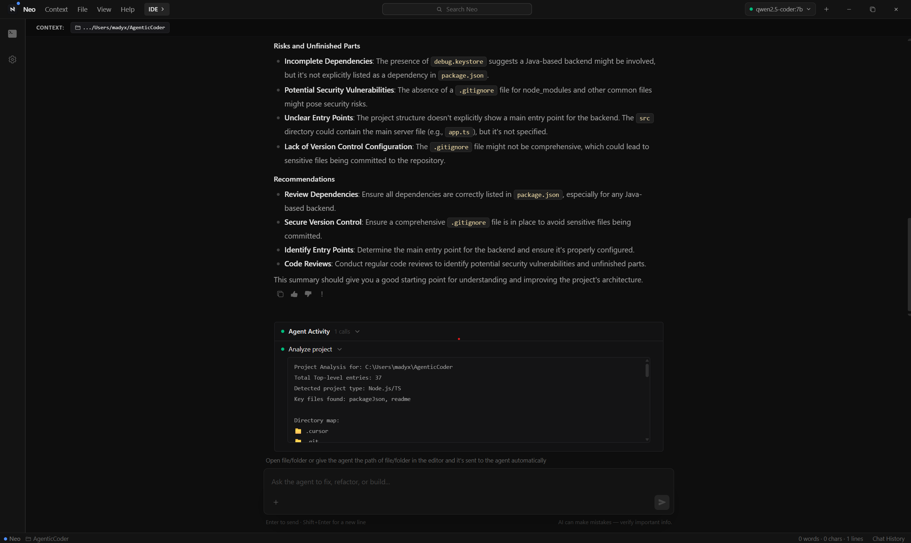
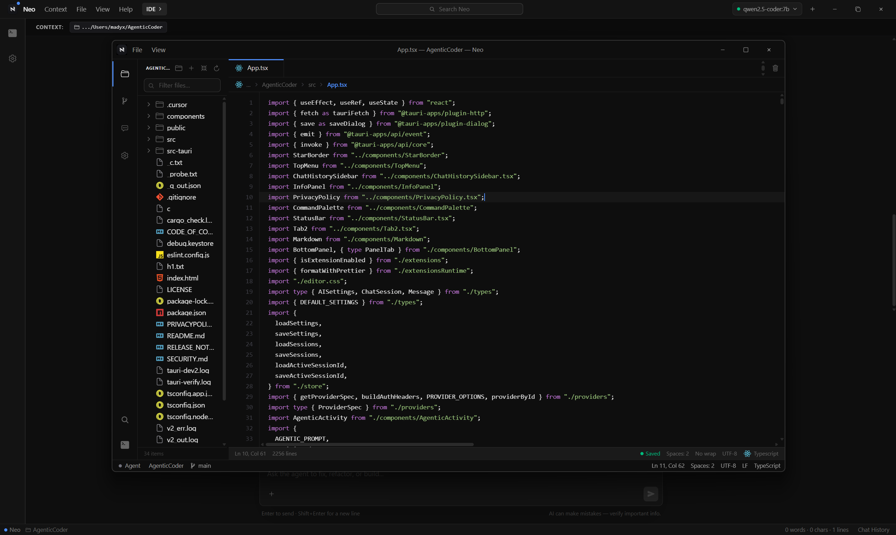

# NEO

### Lightweight Agentic Coding Environment

<p align="left">
  
</p>

> **NEO is currently in beta and under active development.**

NEO is a lightweight agentic coding environment built with **React, TypeScript, Tauri, and Rust**.

It brings an AI agent, code editor, filesystem tools, Git integration, terminals, debugging infrastructure, MCP support, configurable AI providers, local models, and project management into a single desktop environment.

NEO is designed to give AI models access to real development tools while keeping the developer in control of their workspace and changes.

<p align="center">
  
</p>

---

# Overview

Traditional AI coding assistants are often centered around a chat interface.

NEO takes a different approach.

Instead of only generating code in a conversation, the agent can interact with a development workspace through controlled tools.

It can:

* Inspect project files
* Search through workspaces
* Create and modify files
* Review changes
* Work with Git
* Run commands through a terminal
* Interact with local development environments
* Connect to external tools through MCP
* Use cloud or locally hosted AI models

The goal is to provide an environment where AI-assisted development happens alongside the tools developers already use.

---

# Features

## Agentic Coding

NEO provides filesystem tools that allow the agent to interact with development projects.

Available operations include:

```text
read_file
read_file_range
write_file
append_file
replace_in_file
delete_file
delete_dir
create_dir
list_dir
search_files
rename
```

The agent can use these tools to inspect and modify projects according to the user's request.

Destructive operations require explicit user approval.

Agent activity is displayed through an activity timeline showing tool calls, status, and output.

<p align="center">
  
</p>

---

## Context Management

NEO does not automatically expose an entire repository to an AI model.

The agent can access project information through controlled context sources such as:

* Files currently open in the editor
* Explicitly selected files
* Files discovered through search
* Files accessed through filesystem tools

This allows developers to control what information is provided to the model while avoiding unnecessary context.

---

# Integrated Code Editor

NEO includes a built-in code editor designed to work alongside the agent.

Features include:

* Workspace file explorer
* Folder-based workspaces
* Multi-tab editing
* Up to 10 simultaneously open tabs
* LRU tab eviction
* Dirty-state indicators
* Close-all functionality
* Syntax highlighting
* Line-number gutter
* Active-line highlighting
* Breadcrumb navigation
* Cursor position indicators
* Smart indentation
* Automatic indentation
* Native undo history
* Live external file updates

When files are modified externally or by the agent, open editor tabs can update without requiring the file to be reopened.

Toggle the editor with:

```text
Ctrl + Shift + E
```

<p align="center">
  
</p>

---

# Change Review

NEO provides visibility into modifications made during an agent session.

Before changes are applied, users can review proposed modifications through the application's change and diff interfaces.

A typical agent workflow may look like:

```text
Reading file
      ↓
Searching workspace
      ↓
Preparing changes
      ↓
Review changes
      ↓
Apply
```

This gives developers an opportunity to inspect changes before they become part of the project.

---

# Git Integration

NEO integrates Git into the development workflow.

Git functionality provides repository awareness and change visibility while working with the agent.

The integrated diff interface can be used to inspect modifications produced during an agent session.

Git can also be used independently through the integrated terminal.

---

# Integrated PowerShell Terminal

NEO includes an integrated PowerShell terminal backed by a native PTY implementation.

The terminal can run development tools installed on the user's machine, including:

```text
PowerShell
Python
Node.js
npm
Git
Rust
Cargo
```

NEO supports multiple PowerShell sessions, allowing developers to maintain separate environments for:

* Development servers
* Build commands
* Debugging
* Git operations
* Scripts
* Other development processes

NEO does not bundle complete compiler toolchains into the application. It works with the development environments already installed on the user's machine.

---

# Development Infrastructure

NEO includes development-oriented infrastructure for working with local projects.

This includes:

* Process management
* Port awareness
* Multiple terminal sessions
* Local project execution
* Native process integration
* Debugging infrastructure

The application is designed to work with the tools and runtimes available on the user's system.

---

# AI Providers

NEO is designed to be provider-independent.

Users can configure compatible AI endpoints using their own credentials and configuration.

Configuration can include:

* API keys
* Model names
* Base URLs
* System prompts
* Provider-specific configuration

This allows developers to choose the AI infrastructure that fits their workflow.

---

# Local AI Models

NEO supports locally hosted AI models through **Ollama**.

Users can run an Ollama server on their own machine, install models locally, and configure NEO to communicate with the local endpoint.

When using a local model, inference can remain entirely on the user's device.

---

# MCP Support

NEO supports the **Model Context Protocol (MCP)**.

MCP allows additional tools and services to be connected to the agent without requiring every integration to be implemented directly inside NEO.

This provides an extensible way to expand the capabilities available to the agent.

Supported MCP configurations can include:

```text
Remote Streamable HTTP endpoints
Local stdio commands
```

---

# Command Palette

NEO includes a keyboard-driven command palette for accessing application functionality.

Open it with:

```text
Ctrl + Shift + P
```

---

# Keyboard Shortcuts

| Shortcut       | Action                     |
| -------------- | -------------------------- |
| `Ctrl+B`       | Toggle AI settings sidebar |
| `Ctrl+Shift+H` | Toggle chat history        |
| `Ctrl+Shift+P` | Open command palette       |
| `Ctrl+Shift+E` | Toggle code editor         |
| `Ctrl+S`       | Save active file           |

---

# Accounts and Cloud Services

NEO uses a combination of local desktop functionality and hosted services.

The desktop application handles development operations locally through Tauri and Rust, while cloud services are used for account-related and application functionality.

NEO uses **Supabase** for backend services such as:

* Authentication
* User accounts
* Persistent application data
* Cloud-synchronized data
* Subscription-related application state

Workspace files remain on the user's machine and are accessed locally by the desktop application.

Opening a project in NEO does not mean that the entire workspace is automatically uploaded to Supabase.

---

# Privacy and Data

NEO is designed to keep development operations local while allowing users to use cloud-based application services and AI providers.

## Workspace Data

Project files are accessed locally through the NEO desktop application.

Filesystem operations are performed through the Tauri/Rust application layer.

NEO does not require uploading an entire project simply to use the editor or local development tools.

However, files or project information may be sent to an AI provider when required to fulfill an AI request.

---

## AI Provider Data

When an AI model processes project information, relevant information may be transmitted to the AI endpoint configured by the user.

For example:

```text
                    NEO
                     |
                Agent Layer
                     |
          +----------+----------+
          |                     |
       Ollama            Configured API
          |                     |
    Local inference       AI provider
```

When using Ollama locally, inference can remain on the user's device.

When using a third-party AI provider, information sent to that provider is subject to that provider's privacy policy, infrastructure, and terms.

NEO does not control how third-party AI providers process information sent to their endpoints.

---

# Authentication and Application Data

NEO uses Supabase for account and application backend functionality.

Depending on the feature, information stored through the backend may include:

* Account information
* Application preferences
* Chat history
* Subscription state
* Cloud-synchronized application data
* Other application metadata

The exact data stored may change as NEO develops.

---

# Billing

NEO uses **Stripe** for payment processing and subscription management.

Stripe handles payment processing infrastructure, while NEO uses subscription information to determine access to paid functionality.

NEO does not directly handle or store users' complete payment card information.

Billing and subscription functionality may require an active NEO account.

---

# Architecture

NEO uses a hybrid web, native, and cloud architecture.

```text
+------------------------------------------------------+
|                        NEO                           |
|                                                      |
|              React / TypeScript / TSX                |
|                         |                            |
|                         v                            |
|                       Tauri                          |
|                         |                            |
|                         v                            |
|                        Rust                          |
|                         |                            |
|        +----------------+----------------+            |
|        |                |                |            |
|        v                v                v            |
|   Filesystem           Git              PTY          |
|        |                |                |            |
|        +----------------+----------------+            |
|                         |                            |
|                         v                            |
|                   Agent Runtime                      |
|                         |                            |
|              +----------+----------+                 |
|              |                     |                 |
|              v                     v                 |
|       Configured Providers       Ollama              |
|                                    |                 |
|                              Local Models            |
|                                                      |
+--------------------------+---------------------------+
                           |
                           v
                    Backend Services
                           |
                     +-----+-----+
                     |           |
                  Supabase     Stripe
```

---

# Frontend

<p align="left">
  
</p>

The NEO interface is primarily built with:

* React
* TypeScript
* TSX
* Vite
* Tailwind CSS

React provides the application interface and component architecture.

Vite provides the frontend development and build environment.

---

# Native Application Layer

<p align="left">
  
</p>

Tauri provides the native desktop application layer.

Rust handles native functionality including:

* Filesystem operations
* Process management
* PTY integration
* Native system interaction
* Other desktop-level functionality

---

# Mobile

<p align="left">
  
</p>

Kotlin is used for Android-specific functionality within the broader NEO project ecosystem.

---

# Backend

NEO uses **Supabase** for backend infrastructure.

Supabase provides functionality such as:

* Authentication
* Database services
* Persistent application data
* Backend application infrastructure

---

# Payments

NEO uses **Stripe** for subscription and payment infrastructure.

Stripe handles payment processing while NEO uses subscription information to manage access to paid application functionality.

---

# Configuration

<p align="left">
  
</p>

TOML and configuration files are used throughout the project for application, platform, and build configuration.

---

# Development

## Requirements

Development requires the appropriate Tauri prerequisites for the target platform, along with the project's frontend and Rust dependencies.

Typical development environments include:

* Node.js
* npm
* Rust
* Cargo
* Tauri prerequisites
* Git

Additional project-specific runtimes and toolchains can be installed independently.

---

## Clone

```bash
git clone https://github.com/Lumorix-studios/Neo.git
cd Neo
```

## Install Dependencies

```bash
npm install
```

## Run Development Build

```bash
npm run tauri dev
```

---

## Generate Release Notes

Release notes are generated from the Git history and changed files since the
previous `Release_v*` tag:

```bash
npm run release:notes -- 1.0.9
```

This writes `RELEASE_NOTES_v1.0.9.md`. The same generator runs automatically
through npm's `version` lifecycle hook, so `npm version patch`, `npm version
minor`, or `npm version major` creates the matching release-notes file during
the version bump.

---

# Project Status

NEO is currently in **beta** and under active development.

Development began in **May 2026**.

The application's architecture, interface, agent capabilities, APIs, platform support, and internal systems may change between releases.

Current development areas include:

* Agent reliability
* Context management
* Tooling
* Model compatibility
* MCP integrations
* Local model support
* Development workflows
* Performance
* Cloud infrastructure
* Billing infrastructure
* Cross-platform support
* Interface refinement
* Stability

As a beta project, functionality may be incomplete or subject to change.

---

# Roadmap

NEO is continuously developed with a focus on improving the agentic development workflow.

Planned and ongoing areas include:

* Improved agent reliability
* More efficient context handling
* Expanded filesystem tools
* Additional model providers
* Expanded MCP functionality
* Improved debugging workflows
* Additional platform support
* Performance improvements
* Improved project management
* Agent observability
* Cloud synchronization
* Account functionality
* Subscription features
* Stability improvements

---

# Repository

Source code:

https://github.com/Lumorix-studios/Neo

---

<p align="center">
  <strong>NEO</strong><br>
  Lightweight Agentic Coding Environment
</p>

# License

NEO is licensed under the **Apache License 2.0**.

You are free to use, modify, distribute, and commercially use the software, subject to the terms and conditions of the license.

See the [`LICENSE`](LICENSE) file for the complete license text.

Copyright © 2026 Lumorix Studios
